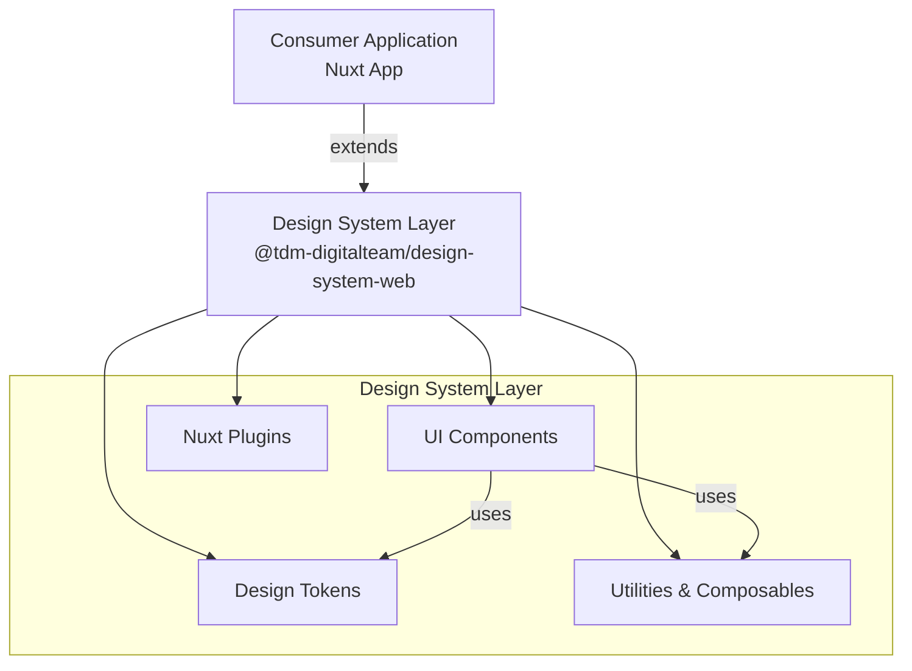

# Architecture Documentation

This document provides a comprehensive overview of the TDM Design System Web architecture, design patterns, and technical implementation details.

---

## Table of Contents

- [Overview](#overview)
- [System Architecture](#system-architecture)
- [Nuxt Layer Architecture](#nuxt-layer-architecture)
- [Project Structure](#project-structure)
- [Component Architecture](#component-architecture)
- [Design Token System](#design-token-system)
- [Styling Approach](#styling-approach)
- [Build and Bundling](#build-and-bundling)
- [Auto-Import System](#auto-import-system)
- [Plugin System](#plugin-system)
- [Type Safety](#type-safety)

---

## Overview

The TDM Design System Web is built as a **Nuxt Layer**, which allows it to be extended by consumer applications while providing:

- **Component Auto-Import** - Components are globally available without explicit imports
- **Shared Configuration** - Tailwind, TypeScript, and build configs are inherited
- **Design Tokens** - Centralized theme and styling system
- **Type Safety** - Full TypeScript support across all components
- **Flexibility** - Consumer apps can override or extend any part

**Tech Stack:**

- **Nuxt 4** - Full-stack Vue framework with Layer support
- **Vue 3** - Composition API, `<script setup>`, and Reactivity
- **Tailwind CSS 4** - Utility-first CSS with CSS variables
- **shadcn-vue** - Unstyled, accessible component primitives
- **Reka UI** - Headless UI components
- **Class Variance Authority (CVA)** - Type-safe component variants
- **vee-validate** - Form validation
- **TypeScript** - Static type checking
- **Storybook** - Component development and documentation

---

## System Architecture



### Architecture Principles

1. **Separation of Concerns** - Components, styling, and logic are clearly separated
2. **Single Responsibility** - Each component has one clear purpose
3. **Composition over Inheritance** - Components are composable and reusable
4. **Open/Closed Principle** - Open for extension, closed for modification
5. **Dependency Inversion** - Depend on abstractions, not implementations

---

## Nuxt Layer Architecture

### What is a Nuxt Layer?

A Nuxt Layer is a reusable Nuxt application that can be extended by other Nuxt applications. It allows sharing:

- Components
- Composables
- Plugins
- Middleware
- Pages (optional)
- Assets and styles
- Configuration

### How It Works

**1. Consumer App extends the layer:**

```typescript
// nuxt.config.ts (consumer app)
export default defineNuxtConfig({
  extends: ["@tdm-digitalteam/design-system-web"],
});
```

**2. Layer configuration is merged:**

The layer's `nuxt.config.ts` is merged with the consumer app's configuration, providing:

- Component auto-import paths
- Tailwind CSS configuration
- TypeScript paths
- Build settings

**3. Components are auto-imported:**

```vue
<!-- In consumer app - no import needed -->
<template>
  <Button>Click me</Button>
</template>
```

### Layer Benefits

- ✅ **Zero Configuration** - Consumer apps work out of the box
- ✅ **Automatic Updates** - Updating the package updates all consumers
- ✅ **Consistency** - Same components across all projects
- ✅ **Flexibility** - Consumer apps can override components
- ✅ **Type Safety** - Full TypeScript support

---

## Project Structure

```
design-system-web/
├── app/                          # Main application directory
│   ├── assets/                   # Static assets
│   │   └── css/
│   │       └── tailwind.css      # Tailwind entry point with @theme
│   ├── components/               # Vue components
│   │   ├── sample/               # Sample/demo components
│   │   └── ui/                   # UI component library
│   │       ├── alert/            # Alert component family
│   │       ├── avatar/           # Avatar component family
│   │       ├── button/           # Button component
│   │       ├── calendar/         # Calendar component family
│   │       ├── ... (40+ components)
│   ├── lib/                      # Shared libraries
│   │   └── utils.ts              # Utility functions (cn helper)
│   ├── plugins/                  # Nuxt plugins
│   └── utils/                    # Helper utilities
│       ├── sonnerHelpers.ts      # Toast helpers
│       └── toastHelpers.ts       # Legacy toast helpers
├── stories/                      # Storybook stories (not published)
│   ├── ColorPalette.stories.ts   # Design token documentation
│   ├── Typography.stories.ts     # Typography system
│   ├── Shadows.stories.ts        # Shadow utilities
│   └── ...
├── .storybook/                   # Storybook configuration
│   ├── main.ts                   # Storybook main config
│   └── preview.ts                # Storybook preview config
├── nuxt.config.ts                # Nuxt layer configuration
├── components.json               # shadcn-vue configuration
├── tsconfig.json                 # TypeScript configuration
├── package.json                  # Package metadata
└── README.md                     # Main documentation
```

### Directory Responsibilities

| Directory               | Purpose                  | Published to NPM |
| ----------------------- | ------------------------ | ---------------- |
| `app/assets`            | CSS, fonts, images       | ✅ Yes           |
| `app/components/ui`     | UI components (exported) | ✅ Yes           |
| `app/components/sample` | Demo/sample components   | ❌ No            |
| `app/lib`               | Utility libraries        | ✅ Yes           |
| `app/utils`             | Helper utilities         | ✅ Yes           |
| `app/plugins`           | Nuxt plugins             | ✅ Yes           |
| `stories/`              | Storybook stories        | ❌ No            |
| `.storybook/`           | Storybook config         | ❌ No            |

---

## Component Architecture

### Component Structure

Each component follows a consistent structure:

```
component-name/
├── ComponentName.vue           # Main component
├── ComponentNamePart1.vue      # Sub-components (if needed)
├── ComponentNamePart2.vue
├── index.ts                    # Exports (optional)
└── ComponentName.stories.ts    # Storybook story (not published)
```

### Component Design Pattern

Components are built using the **Compound Component Pattern**:

```vue
<!-- Example: Dialog component -->
<template>
  <Dialog>
    <DialogTrigger>Open</DialogTrigger>
    <DialogContent>
      <DialogHeader>
        <DialogTitle>Title</DialogTitle>
        <DialogDescription>Description</DialogDescription>
      </DialogHeader>
      <DialogFooter>
        <Button>Close</Button>
      </DialogFooter>
    </DialogContent>
  </Dialog>
</template>
```

**Benefits:**

- Clear component relationships
- Flexible composition
- Type-safe props
- Accessible by default

### Component Principles

1. **Accessibility First** - WCAG 2.1 AA compliance
2. **Composable** - Components work together
3. **Customizable** - Props for common variations
4. **Type-Safe** - Full TypeScript interfaces
5. **Documented** - Storybook stories with examples

### Base Component Template

```vue
<script setup lang="ts">
import { cn } from "@/lib/utils";
import { cva, type VariantProps } from "class-variance-authority";

// Define variants using CVA
const componentVariants = cva("base-classes", {
  variants: {
    variant: {
      default: "variant-specific-classes",
      outline: "outline-variant-classes",
    },
    size: {
      sm: "small-size-classes",
      md: "medium-size-classes",
      lg: "large-size-classes",
    },
  },
  defaultVariants: {
    variant: "default",
    size: "md",
  },
});

// Define props interface
interface Props {
  variant?: VariantProps<typeof componentVariants>["variant"];
  size?: VariantProps<typeof componentVariants>["size"];
  class?: string;
}

const props = withDefaults(defineProps<Props>(), {
  variant: "default",
  size: "md",
});
</script>

<template>
  <div :class="cn(componentVariants({ variant, size }), props.class)">
    <slot />
  </div>
</template>
```

---

## Design Token System

### Token Architecture

Design tokens are defined in Tailwind CSS 4's `@theme` directive:

```css
/* app/assets/css/tailwind.css */
@theme {
  /* Colors */
  --color-primary: #0066ff;
  --color-success: #10b981;
  --color-warning: #f59e0b;
  --color-error: #ef4444;

  /* Text emphasis */
  --color-text-high: rgba(0, 0, 0, 0.87);
  --color-text-medium: rgba(0, 0, 0, 0.6);
  --color-text-low: rgba(0, 0, 0, 0.38);

  /* Typography */
  --font-family-montserrat: "Montserrat", sans-serif;
  --font-family-opensans: "Open Sans", sans-serif;

  /* Spacing, shadows, etc. */
}
```

### Token Categories

1. **Colors**

   - Primary, secondary
   - Success, warning, info, error
   - Text emphasis levels
   - Background and surface colors

2. **Typography**

   - Font families
   - Font sizes
   - Line heights
   - Font weights

3. **Spacing**

   - Padding and margin scale
   - Gap utilities

4. **Shadows**

   - Elevation levels (sm, md, lg, xl, 2xl)

5. **Borders**
   - Border radius
   - Border widths

### Token Usage

```vue
<template>
  <!-- Using color tokens -->
  <div class="bg-primary text-white">Primary background</div>

  <!-- Using typography tokens -->
  <h1 class="font-montserrat text-4xl">Heading</h1>
  <p class="font-opensans text-base text-text-medium">Body</p>

  <!-- Using shadow tokens -->
  <div class="shadow-md">Elevated card</div>
</template>
```

---

## Styling Approach

### Tailwind CSS 4 with CSS Variables

The design system uses **Tailwind CSS 4** with the new `@theme` directive:

**Benefits:**

- ✅ Real CSS variables (no more JIT compilation issues)
- ✅ Runtime theming support
- ✅ Better IDE autocomplete
- ✅ Smaller bundle sizes

### Class Variance Authority (CVA)

CVA provides type-safe component variants:

```typescript
import { cva } from "class-variance-authority";

const buttonVariants = cva(
  "inline-flex items-center justify-center rounded-md",
  {
    variants: {
      variant: {
        default: "bg-primary text-white hover:bg-primary/90",
        outline: "border border-gray-300 bg-transparent",
        ghost: "hover:bg-gray-100",
      },
      size: {
        sm: "h-8 px-3 text-sm",
        md: "h-10 px-4",
        lg: "h-12 px-6 text-lg",
      },
    },
    defaultVariants: {
      variant: "default",
      size: "md",
    },
  }
);
```

### The `cn` Utility

The `cn` (classnames) utility merges Tailwind classes intelligently:

```typescript
// app/lib/utils.ts
import { clsx } from "clsx";
import { twMerge } from "tailwind-merge";

export function cn(...inputs: ClassValue[]) {
  return twMerge(clsx(inputs));
}
```

**Usage:**

```vue
<Button :class="cn('custom-class', isActive && 'active-class')">
  Click me
</Button>
```

---

## Build and Bundling

### Build Process

1. **Development**

   ```bash
   pnpm run dev          # Start Nuxt dev server
   pnpm run storybook    # Start Storybook
   ```

2. **Production Build**

   ```bash
   pnpm run build        # Build Nuxt app
   pnpm run build-storybook  # Build Storybook
   ```

3. **NPM Package**
   ```bash
   pnpm run dev:prepare  # Prepare Nuxt layer
   npm publish           # Publish to NPM
   ```

### Published Files

The `package.json` `files` field defines what's published:

```json
{
  "files": [
    "app/assets",
    "app/components/**/*.vue",
    "app/components/**/*.ts",
    "!app/components/**/*.stories.ts",
    "app/lib",
    "app/utils",
    "app/plugins",
    "nuxt.config.ts",
    "tsconfig.json",
    "components.json",
    "README.md"
  ]
}
```

### Tree Shaking

- ✅ Components are tree-shakeable
- ✅ Only imported utilities are bundled
- ✅ Unused Tailwind classes are purged

---

## Auto-Import System

### Component Auto-Import

Components are automatically imported via Nuxt Layer configuration:

```typescript
// nuxt.config.ts
export default defineNuxtConfig({
  components: [
    {
      path: join(currentDir, "./app/components/ui"),
      pathPrefix: false,
      global: true, // Makes components globally available
    },
  ],
});
```

### Composable Auto-Import

Utilities and composables are auto-imported:

```typescript
// nuxt.config.ts
export default defineNuxtConfig({
  imports: {
    dirs: [
      join(currentDir, "./app/composables"),
      join(currentDir, "./app/utils"),
      join(currentDir, "./app/lib"),
    ],
  },
});
```

### Manual Imports

Some utilities require manual import:

```typescript
// Utility function
import { cn } from "@tdm-digitalteam/design-system-web/lib/utils";

// Toast helpers
import { toast } from "vue-sonner";
```

---

## Plugin System

### Available Plugins

Currently, the design system doesn't include Nuxt plugins by default, but consumer apps can add plugins:

```typescript
// plugins/my-plugin.ts (in consumer app)
export default defineNuxtPlugin((nuxtApp) => {
  // Plugin logic
});
```

### Future Plugin Candidates

Potential plugins for future releases:

- Toast notification manager
- Theme switcher (dark mode)
- Form validation helpers
- Analytics integration

---

## Type Safety

### TypeScript Configuration

The design system uses TypeScript with strict mode:

```json
// tsconfig.json
{
  "references": [
    { "path": "./.nuxt/tsconfig.app.json" },
    { "path": "./.nuxt/tsconfig.server.json" },
    { "path": "./.nuxt/tsconfig.shared.json" },
    { "path": "./.nuxt/tsconfig.node.json" }
  ]
}
```

### Component Props

All components have fully typed props:

```typescript
interface ButtonProps {
  variant?: "default" | "outline" | "ghost";
  size?: "sm" | "md" | "lg";
  disabled?: boolean;
  type?: "button" | "submit" | "reset";
}
```

### Type Exports

Types are exported for consumer use:

```typescript
// Consumer app
import type { ButtonProps } from "@tdm-digitalteam/design-system-web/components/ui/button";
```

### CVA Type Safety

CVA provides type inference:

```typescript
import { type VariantProps } from "class-variance-authority";

type ButtonVariants = VariantProps<typeof buttonVariants>;
// { variant?: 'default' | 'outline' | 'ghost', size?: 'sm' | 'md' | 'lg' }
```

---

## Performance Considerations

### Bundle Size Optimization

- **Tree Shaking** - Unused components are excluded
- **CSS Purging** - Unused Tailwind classes removed
- **Code Splitting** - Components lazy-loaded when needed
- **Minimal Dependencies** - Only essential packages included

### Runtime Performance

- **Virtual DOM** - Vue 3's optimized rendering
- **Composition API** - Better performance than Options API
- **CSS Variables** - Fast runtime theming
- **Lazy Loading** - Components loaded on-demand

---

## Security Considerations

- **XSS Protection** - Vue's automatic HTML escaping
- **CSP Compatible** - No inline styles or scripts
- **No eval()** - No dynamic code execution
- **Dependency Audits** - Regular `npm audit` checks

---

## Best Practices

### For Design System Maintainers

1. **Follow Accessibility Guidelines** - All components must be WCAG 2.1 AA compliant
2. **Write Storybook Stories** - Every component needs documentation
3. **Type Everything** - No `any` types allowed
4. **Test Responsiveness** - Mobile-first approach
5. **Document Breaking Changes** - Use semantic versioning

### For Consumer Applications

1. **Use Component Composition** - Leverage compound components
2. **Extend, Don't Modify** - Override via props, not direct edits
3. **Follow Design Tokens** - Use tokens instead of arbitrary values
4. **Test Accessibility** - Use screen readers and keyboard navigation
5. **Keep Updated** - Regularly update to latest version

---

## Migration Guide

### From shadcn-vue Direct Usage

If migrating from direct shadcn-vue usage:

1. Replace `import` with auto-imported components
2. Update component names if changed
3. Check for prop changes in CHANGELOG

### Version Updates

Follow semantic versioning:

- **Patch** (1.0.x) - Bug fixes, safe to update
- **Minor** (1.x.0) - New features, backward compatible
- **Major** (x.0.0) - Breaking changes, check migration guide

---

## Troubleshooting

See [USAGE.md](USAGE.md) for common issues and solutions.

---

## Additional Resources

- [Nuxt Layer Documentation](https://nuxt.com/docs/guide/going-further/layers)
- [Tailwind CSS 4 Documentation](https://tailwindcss.com/docs)
- [shadcn-vue Documentation](https://www.shadcn-vue.com/)
- [Class Variance Authority](https://cva.style/docs)
- [Reka UI](https://reka-ui.com/)
